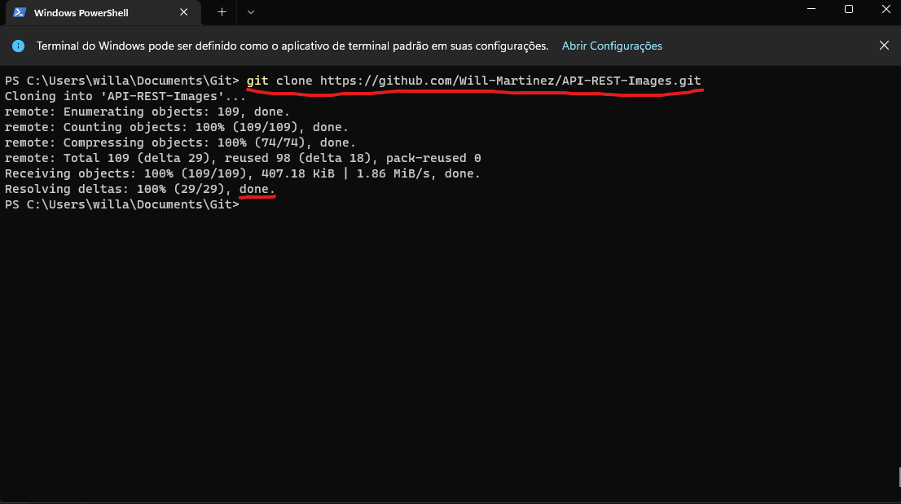
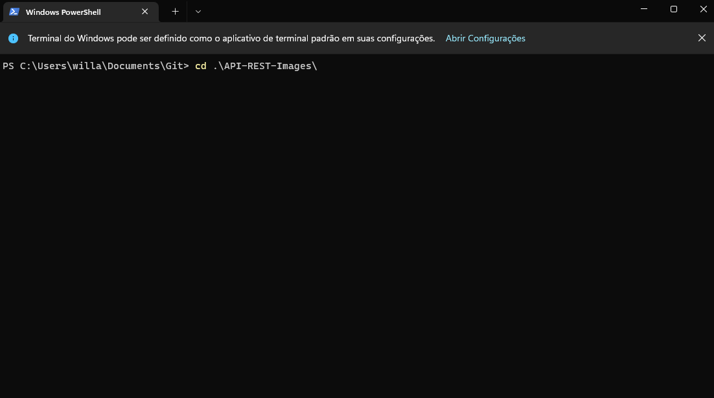
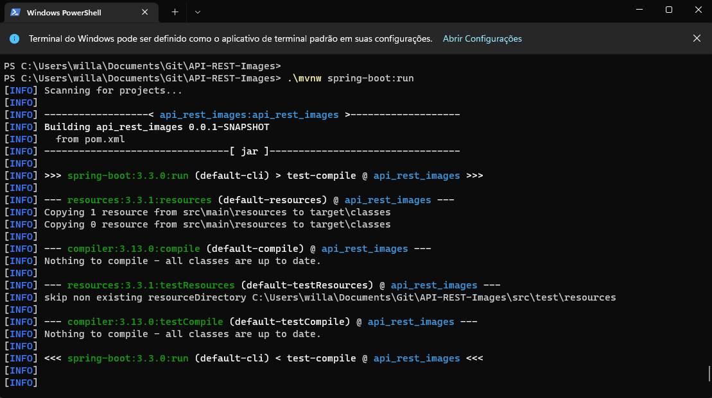
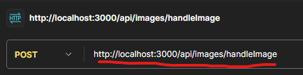
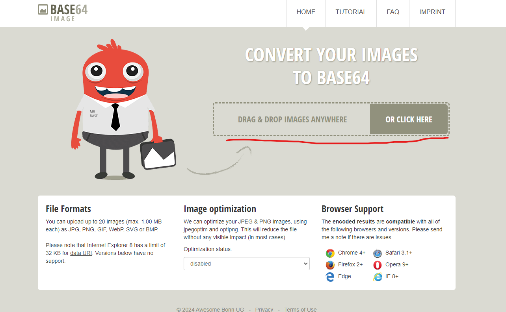
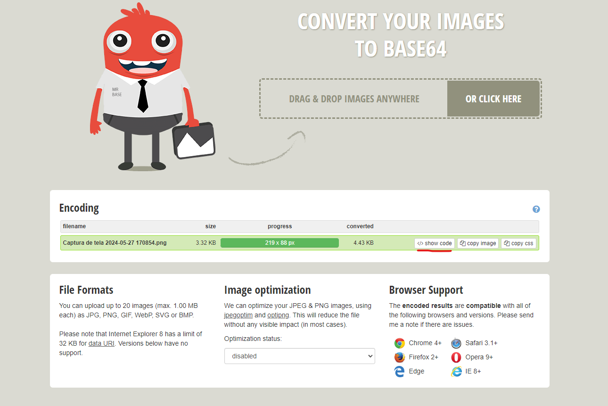
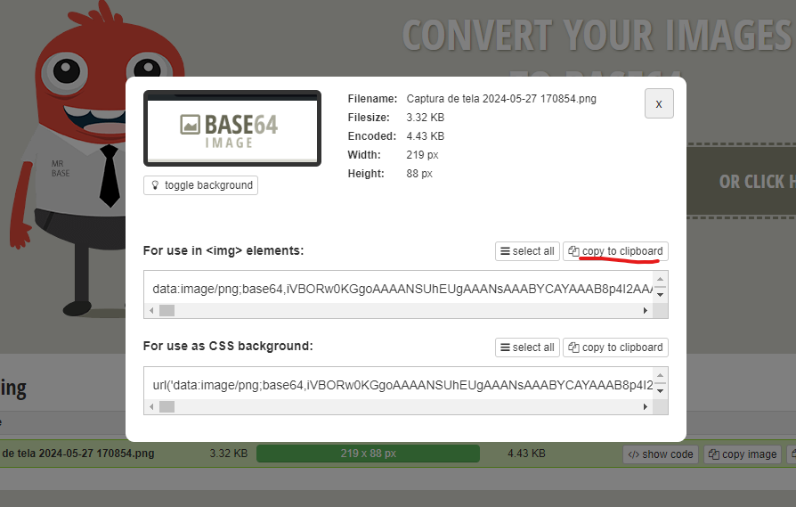
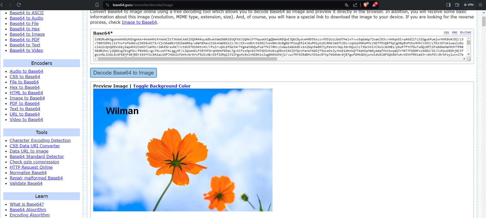
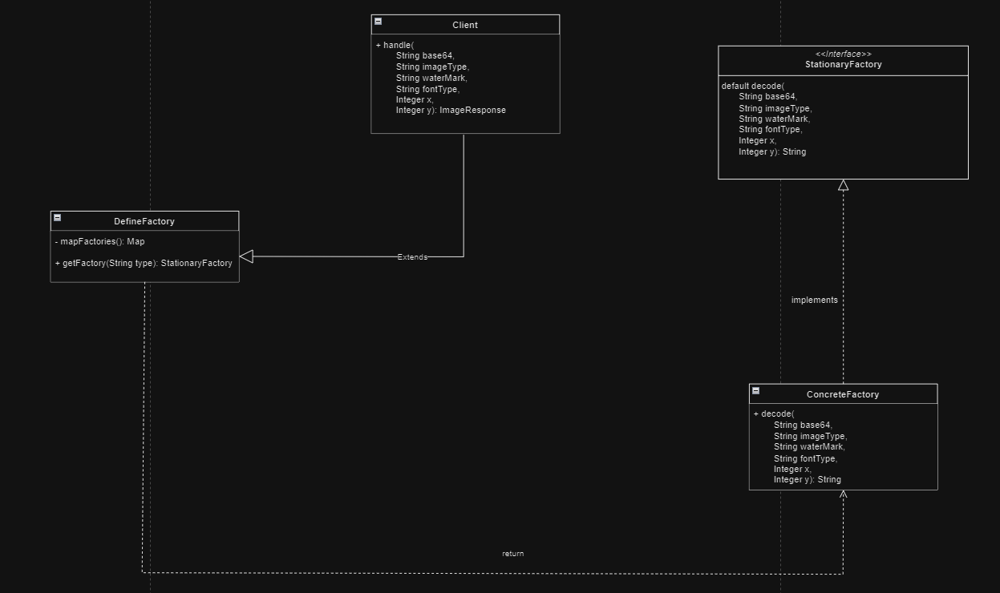

# API-REST-IMAGES.

## Descrição.
Implementação de uma API REST em Sprint Boot para manipulação de imagens

## Requisitos de funcionamento.
- Necessário ter instalado em seu computador o JDK na versão 22+ para execução do app.
- Para baixar o JDK, pode acessar esse link(https://www.oracle.com/br/java/technologies/downloads/#java22).
- Postman para realizar o teste da API. acessível pra download no link(https://www.postman.com/downloads/).
- Git para realizar o clone do repositório ná maquina local. Disponível no link(https://git-scm.com/downloads)

## Como iniciar/configurar a aplicação.
### Aplicação
- A aplicação foi construida utilizando a IDE IntelliJ da Jet Brains, mas essa IDE não precisa ser baixada.
- acesse seu terminal do sistema operacional e faça o seguinte processo:
  
  - navegue até a pasta onde deseja colocar o clone da aplicação.
  - use o comando git clone com a url https://github.com/Will-Martinez/API-REST-Images.git para clonar o repositório na máquina local.
    
  - Use o comando "cd" para o diretorio da aplicação.
    
  - Use o comando de dentro do projeto .\mvnw spring-boot:run, para iniciar a aplicação
    
  - Após esse procedimento, a aplicação estará rodando no endereço local, sendo ele http://localhost:3000/.

### Postman
- Após a aplicação ser inicializada, use o Postman para realizar o consumo da API. Caso queira instalar outra ferramenta como o Insominia, fique a vontadade pois o conceito é o mesmo.
- A API exposta com o endpoint correto para lidar com as imagens é /api/images/handleImage. Veja o exemplo abaixo.
  
- Para realizar testes com o postman, siga o seguinte procedimento:
  - A requisição do corpo precisa receber uma string, sendo a base64, tipo da imagem, marca d'água, tipo da fonte, o eixo x e o eixo y para posicionar a marca d'água. Copie e cole o exemplo abaixo.
  
```json
{
        "base64": "aqui vai sua string de base64",
        "imageType": "png",
        "waterMark": "Wilman",
        "fontType": "Arial",
        "x": 50,
        "y": 100
}
```

- Para coletar a base64 de sua imagem, acesse o link(https://www.base64-image.de/) e coloque a imagem que quiser para coletar a base64.
  
- Em seguida clique para exibir o código e depois pra colar a base64 da imagem
  
  
- Com essa string copiada, subistitua no json o valor da chave base64 com o que foi copiado.

## Documentação da API
### POST /api/images/handleImage

Manipula uma imagem para adicionar uma marca d'água.

**Parâmetros**

| Nome      | Tipo    | Descrição                                                |
|-----------|---------|----------------------------------------------------------|
| base64    | String  | String contendo a informação de base64 da imagem.        |
| imageType | String  | String informando a extensão da imagem.                  | 
| waterMark | String  | String contendo a marca d'água desejada.                 |
| fontType  | String  | String contendo a qual font deseja criar a marca d'água. |
| x         | Integer | Número inteiro para informar a posição do eixo x.        |
| y         | String | Número inteiro para informar a posição do eixo y         | 

**Exemplo de requisição**
```json
{
        "base64": "data:image/png;base64,iVBORw0KGgoAAAANSUhE...resto da string",
        "imageType": "png",
        "waterMark": "Wilman",
        "fontType": "Arial",
        "x": 50,
        "y": 100
}
```

**Exemplo de resposta**

```json

{
    "base64WithWaterMark": "iVBORw0KGgoAAAANSUhEUg...resto da string",
    "imageType": "png",
    "success": true
}

```

- Caso queira verificar a imagem com a marca d'água, acesse o link(https://base64.guru/converter/decode/image), coloque o valor string resultante da chave base64WithWaterMark que aparece na resposta da api e a imagem irá aparecer conforme abaixo.
  


## Serviço de imagem
Ao projetar o serviço das imagens, foram priorizados dois aspectos-chave para garantir uma implementação eficiente:

- Consistência entre os tipos de imagens:
  Assegurar que as imagens manipuladas pelo serviço sejam consistentes entre si, mantendo uma estrutura coesa e compatível dentro de cada categoria de imagem.

- Isolamento do Cliente:
  Isolar o cliente das fabricas concretas, proporcionando a utilização apenas de uma interface pertinente. Isso visa simplificar a interação do cliente com o serviço, reduzindo a dependência de implementações específicas.

para atender a esses requisitos e determinar qual fábrica concreta utilizar e acessar o método de criação, foi incorporado o Factory Method Pattern. Isso permite que o cliente defina dinamicamente a fábrica a ser utilizada, oferecendo uma abordagem modular e extensível.

diagrama em UML das classes ilustrando o funcionamento do serviço:
